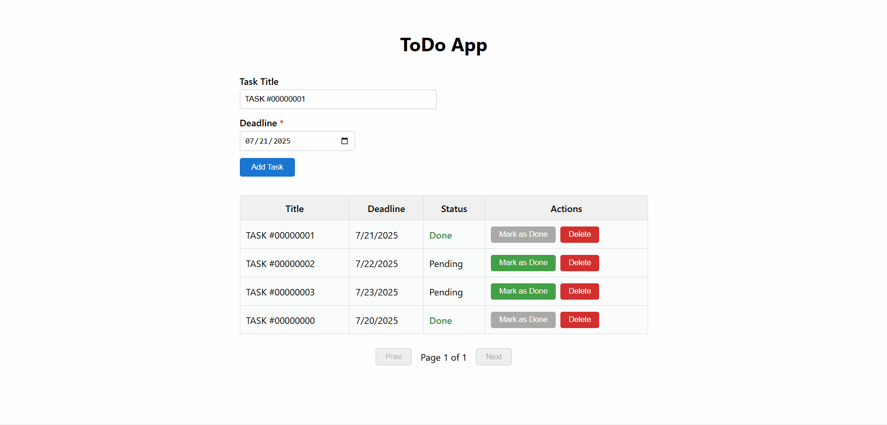

# ToDoApp

## Demo



## Project Overview

This repository contains a full-stack ToDo application built with ReactJS (TypeScript) for the frontend and C# (ASP.NET Core) for the backend. The app allows users to manage their tasks efficiently, with features such as deadlines, overdue highlighting, pagination, and persistent storage (in-memory for demo).

## Features
- Add tasks (title > 10 characters, deadline required)
- Set deadline (defaults to today)
- Overdue tasks are highlighted and status shown
- Tasks displayed in a paginated table
- Mark tasks as done
- Delete tasks
- Persistent data storage (in-memory backend)
- Error handling and validation (frontend and backend)
- CORS enabled for development

## Backend Details
- **Pagination:** `GET /api/tasks?page=1&pageSize=10` returns paginated results and total count.
- **Validation:** Task title must be longer than 10 characters, deadline is required (enforced on backend and frontend).
- **CORS:** Allows any origin in development; production policy can be customized.

## Tech Stack
- **Frontend:** ReactJS, TypeScript
- **Backend:** C# (ASP.NET Core Web API)
- **Data Storage:** In-memory (for demo; see notes below)

## Setup Instructions

### Prerequisites
- Node.js & npm (for frontend)
- .NET 6+ SDK (for backend)

### 1. Clone the repository
```bash
git clone <repo-url>
cd ToDoApp
```

### 2. Backend Setup
```bash
cd backend
# Restore dependencies
dotnet restore
# Run the backend server (default: http://localhost:5000)
dotnet run --urls=http://localhost:5000
```

### 3. Frontend Setup
```bash
cd frontend
npm install
npm start
```

The app will be available at [http://localhost:3000](http://localhost:3000).

## Production Notes / Further Improvements
- Use persistent storage (e.g., SQLite, PostgreSQL) instead of in-memory
- Add authentication and authorization
- Implement filtering and sorting
- Add unit and integration tests
- Use DTOs and mapping for API models
- Add logging, monitoring, and error tracking
- Rate limiting and security best practices
- API versioning

## Development Plan
This project was developed in the following steps:
1. Update README
2. Set up frontend skeleton (React + TypeScript)
3. Set up backend skeleton (C# ASP.NET Core)
4. Implement frontend task table and form
5. Implement backend data storage (in-memory)
6. Integrate frontend and backend
7. Add pagination, CORS, and polish
8. Final review and documentation

---

Feel free to reach out if you have any questions or suggestions!